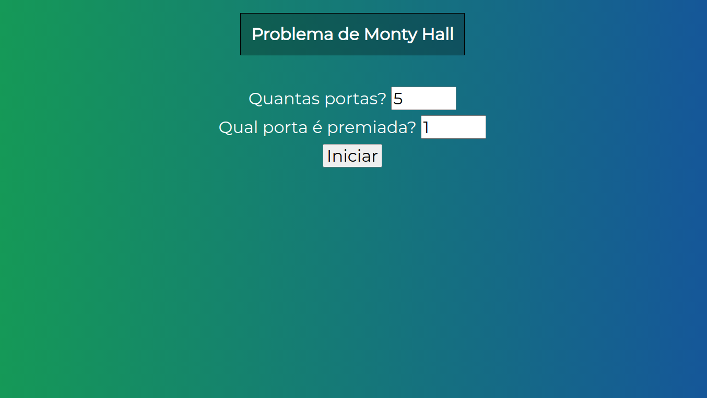
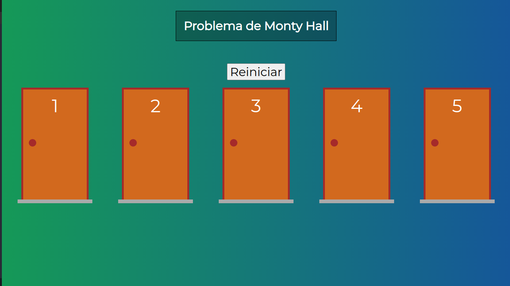
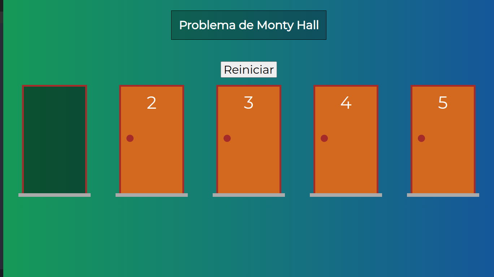
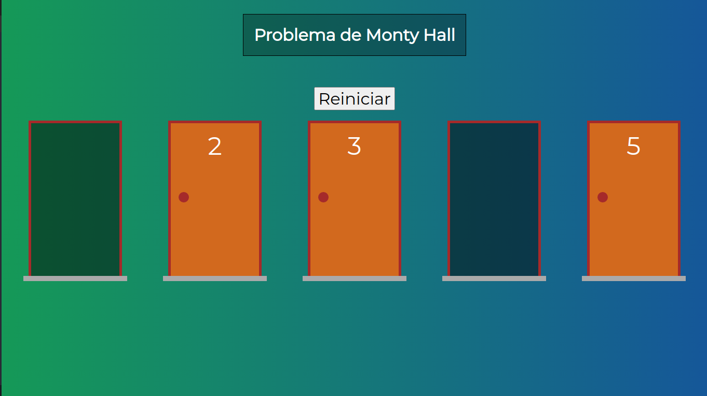
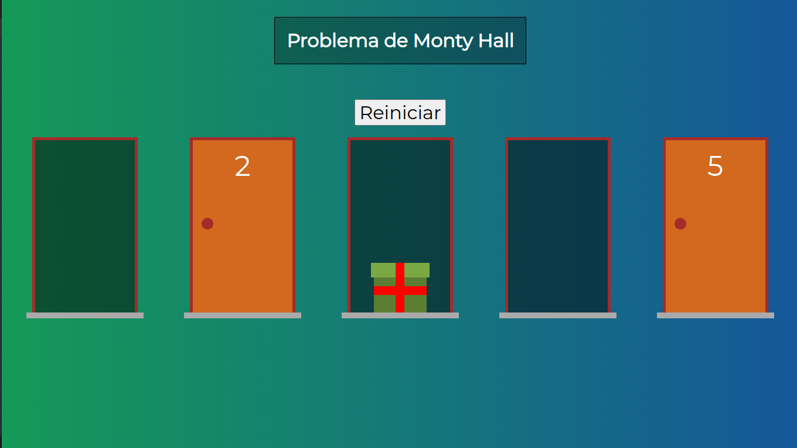

# PROBLEMA DE MONTYHALL 

O problema de Monty Hall consiste em um jogo logico em que um participante escolhe uma das porta sem saber o que há dentro. Depois da escolha é aberta uma das portas, para então começar a etapa lógica, onde o participante é perguntado se permance ou se troca de porta, podendo ganhar ou perder ao final do jogo. 

Utilizando os principios em VueJs, o projeto foi criado inspirado nesse jogo.

A imagem um é a seleção da quantidade de portas e também a porta premiada. 

 
 

No inicio do jogo é pedido ao participante escolher uma porta.

 
 

Após a escolha, um das portas é aberta e perguntado ao participante se ele quer trocar de porta.

 
 

Se o participante não trocar de porta outra porta é aberta. Caso ele troque porta, a porta anterior é aberta. 

 
 

E o jogo segue até haver duas portas onde será revelado e o participante ganhou ou não. Mas no caso da imagem o premio foi revelado estando na porta escolhida pelo participante que resolver trocar de porta. 